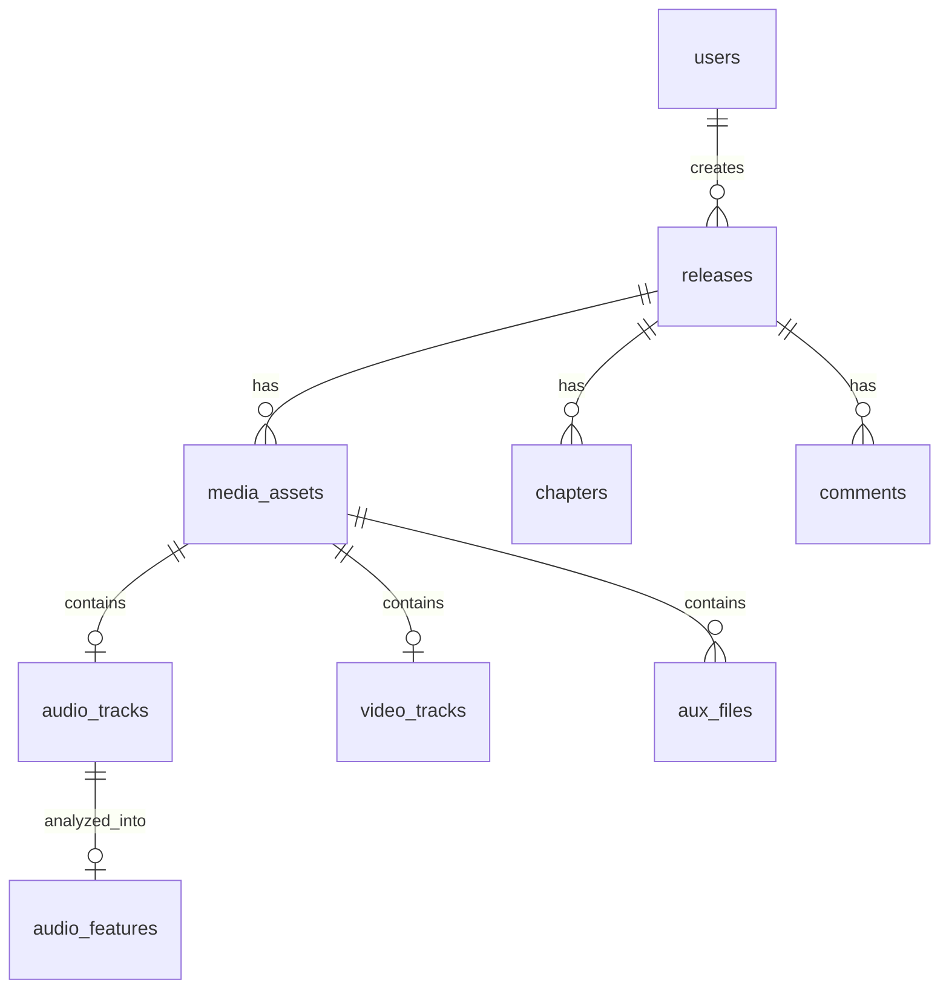

# 🗄️ Phase 2: Database Schema & Vector Search

> **Steps 11–20** · Estimated effort: 1–2 days
> Cross-reference: [main_idea.md](file:///Users/test2/Documents/dynamics-art/docs/main_idea.md) §2 (SDD), §3 (Split Pipeline), §YouTube Addendum, §Interactive Canvas Addendum

---

## Objective

Define the complete PostgreSQL schema — users, releases, decoupled media assets, DSP metadata, interactive auxiliary files, engagement tables, and pgvector embeddings — then run the initial migration.

---

## Entity Relationship Overview



---

## Steps

### Step 11 — Users Schema

```sql
CREATE TABLE users (
  id UUID PRIMARY KEY DEFAULT gen_random_uuid(),
  email TEXT UNIQUE NOT NULL,
  display_name TEXT,
  avatar_url TEXT,
  subscription_tier TEXT NOT NULL DEFAULT 'free'
    CHECK (subscription_tier IN ('free', 'premium')),
  stripe_customer_id TEXT,
  created_at TIMESTAMPTZ DEFAULT NOW(),
  updated_at TIMESTAMPTZ DEFAULT NOW()
);
```

### Step 12 — Releases Schema

```sql
CREATE TABLE releases (
  id UUID PRIMARY KEY DEFAULT gen_random_uuid(),
  creator_id UUID NOT NULL REFERENCES users(id) ON DELETE CASCADE,
  title TEXT NOT NULL,
  description TEXT,
  visibility TEXT NOT NULL DEFAULT 'draft'
    CHECK (visibility IN ('draft', 'public', 'unlisted', 'private')),
  play_count BIGINT DEFAULT 0,
  current_media_asset_id UUID,  -- FK added after media_assets created
  created_at TIMESTAMPTZ DEFAULT NOW(),
  updated_at TIMESTAMPTZ DEFAULT NOW()
);
```

### Step 13 — Media Abstraction

The `media_assets` table decouples physical files from `releases` to support non-destructive replacement. Replacing a file creates a new row and updates the foreign key pointer.

```sql
CREATE TABLE media_assets (
  id UUID PRIMARY KEY DEFAULT gen_random_uuid(),
  release_id UUID NOT NULL REFERENCES releases(id) ON DELETE CASCADE,
  version INT NOT NULL DEFAULT 1,
  status TEXT NOT NULL DEFAULT 'processing'
    CHECK (status IN ('processing', 'ready', 'failed', 'replaced')),
  duration_ms BIGINT,
  created_at TIMESTAMPTZ DEFAULT NOW()
);

ALTER TABLE releases
  ADD CONSTRAINT fk_current_media
  FOREIGN KEY (current_media_asset_id) REFERENCES media_assets(id);
```

### Step 14 — Audio Tracks Schema

```sql
CREATE TABLE audio_tracks (
  id UUID PRIMARY KEY DEFAULT gen_random_uuid(),
  media_asset_id UUID UNIQUE NOT NULL REFERENCES media_assets(id) ON DELETE CASCADE,
  lufs_raw REAL,
  spectral_flatness REAL,
  gain_offset_db REAL,
  flac_url TEXT,
  opus_url TEXT,
  sample_rate INT,
  bit_depth INT,
  created_at TIMESTAMPTZ DEFAULT NOW()
);
```

### Step 15 — Video Tracks Schema

```sql
CREATE TABLE video_tracks (
  id UUID PRIMARY KEY DEFAULT gen_random_uuid(),
  media_asset_id UUID UNIQUE NOT NULL REFERENCES media_assets(id) ON DELETE CASCADE,
  hls_manifest_url TEXT,
  resolution_tiers JSONB DEFAULT '["1080p","720p","480p"]',
  created_at TIMESTAMPTZ DEFAULT NOW()
);
```

### Step 16 — Auxiliary Files Schema

```sql
CREATE TABLE aux_files (
  id UUID PRIMARY KEY DEFAULT gen_random_uuid(),
  media_asset_id UUID NOT NULL REFERENCES media_assets(id) ON DELETE CASCADE,
  file_type TEXT NOT NULL CHECK (file_type IN ('midi', 'musicxml', 'webvtt', 'srt')),
  file_url TEXT NOT NULL,
  language_code TEXT,  -- e.g., 'it', 'en' for opera translations
  created_at TIMESTAMPTZ DEFAULT NOW()
);
```

### Step 17 — pgvector Setup

> ⚠️ Run this in the Supabase SQL Editor manually.

```sql
CREATE EXTENSION IF NOT EXISTS vector;
```

### Step 18 — Embeddings / Audio Features Schema

```sql
CREATE TABLE audio_features (
  id UUID PRIMARY KEY DEFAULT gen_random_uuid(),
  audio_track_id UUID UNIQUE NOT NULL REFERENCES audio_tracks(id) ON DELETE CASCADE,
  feature_vector vector(128),  -- librosa feature dimensions
  tempo REAL,
  key TEXT,
  created_at TIMESTAMPTZ DEFAULT NOW()
);
```

### Step 19 — Engagement Schema

```sql
CREATE TABLE chapters (
  id UUID PRIMARY KEY DEFAULT gen_random_uuid(),
  release_id UUID NOT NULL REFERENCES releases(id) ON DELETE CASCADE,
  title TEXT NOT NULL,
  timestamp_ms BIGINT NOT NULL,
  sort_order INT NOT NULL DEFAULT 0
);

CREATE TABLE comments (
  id UUID PRIMARY KEY DEFAULT gen_random_uuid(),
  release_id UUID NOT NULL REFERENCES releases(id) ON DELETE CASCADE,
  user_id UUID NOT NULL REFERENCES users(id) ON DELETE CASCADE,
  body TEXT NOT NULL,
  timestamp_ms BIGINT,  -- nullable for non-timestamped comments
  parent_id UUID REFERENCES comments(id) ON DELETE CASCADE,
  created_at TIMESTAMPTZ DEFAULT NOW()
);

CREATE INDEX idx_comments_release_ts ON comments(release_id, timestamp_ms);
CREATE INDEX idx_chapters_release ON chapters(release_id, sort_order);
```

### Step 20 — Migrate DB

- Define all tables above in Drizzle schema files under `src/db/schema/`
- Generate migration: `npx drizzle-kit generate`
- **Ask user before running migration** — provide the SQL for manual execution in Supabase SQL Editor if preferred

---

## Verification Checklist

- [ ] All tables exist in Supabase Dashboard → Table Editor
- [ ] `pgvector` extension is enabled (`SELECT extversion FROM pg_extension WHERE extname = 'vector'`)
- [ ] Foreign key relationships are correct (test with sample INSERT/DELETE cascades)
- [ ] `audio_features.feature_vector` column accepts 128-dimension vectors
- [ ] Indexes on `comments` and `chapters` are visible in Supabase

---

## Files Created / Modified

| Action | Path |
|---|---|
| NEW | `src/db/schema/users.ts` |
| NEW | `src/db/schema/releases.ts` |
| NEW | `src/db/schema/media-assets.ts` |
| NEW | `src/db/schema/audio-tracks.ts` |
| NEW | `src/db/schema/video-tracks.ts` |
| NEW | `src/db/schema/aux-files.ts` |
| NEW | `src/db/schema/audio-features.ts` |
| NEW | `src/db/schema/chapters.ts` |
| NEW | `src/db/schema/comments.ts` |
| NEW | `drizzle.config.ts` |
