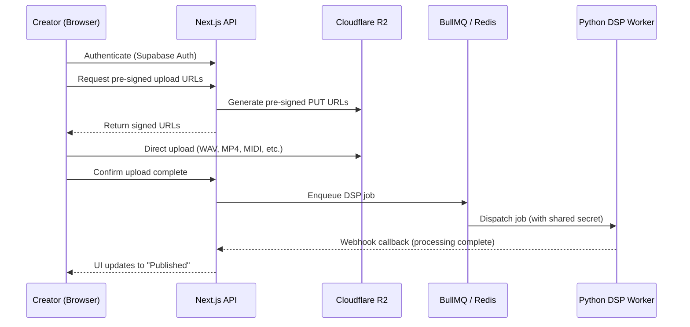

# 🔒 Phase 3: Auth, Security & Creator Upload UX

> **Steps 21–30** · Estimated effort: 2–3 days
> Cross-reference: [main_idea.md](file:///Users/test2/Documents/dynamics-art/docs/main_idea.md) §Security Addendum (Trojan Problem, Ripping Problem, Webhooks)

---

## Objective

Implement user authentication, secure file upload to R2 via pre-signed URLs, webhook communication between Next.js and the Python worker, and the Creator Upload Dashboard.

---

## Architecture Flow



---

## Steps

### Step 21 — Authentication
- Install `@supabase/supabase-js` and `@supabase/ssr`
- Create Supabase client utilities: `src/lib/supabase/client.ts` (browser) and `src/lib/supabase/server.ts` (server)
- Build Next.js middleware (`src/middleware.ts`) to protect `/dashboard/*` and `/api/creator/*` routes
- Implement sign-up / sign-in pages with email + OAuth (Google)

### Step 22 — Multiplex Upload UI
- Build `src/app/dashboard/upload/page.tsx` — the Creator Upload Dashboard
- Support simultaneous drag-and-drop file selection:
  - **Audio:** `.wav`, `.flac`, `.aiff` (24-bit uncompressed)
  - **Video:** `.mp4`, `.mov`
  - **Score:** `.mxl`, `.musicxml`
  - **Performance:** `.mid`
  - **Lyrics:** `.vtt`, `.srt`
- Display selected files in a preview panel with file type badges

### Step 23 — The Trojan Problem (File Validation)
- Server-side MIME-type validation via magic number header inspection (not just file extensions)
- Allowlist approach — only accept known-safe MIME types
- Use a library like `file-type` (Node.js) to detect true file type from buffer
- Reject all files that don't match expected signatures

### Step 24 — Pre-signed Uploads
- Create API route `POST /api/upload/presign`
- Generate temporary, expiring pre-signed PUT URLs for direct browser → R2 upload
- Each URL scoped to a specific object key: `uploads/{userId}/{releaseId}/{filename}`
- URLs expire after 15 minutes

### Step 25 — Upload State
- Implement upload progress tracking via `XMLHttpRequest` or `fetch` with progress events
- UI states: `Selecting → Uploading (XX%) → Processing... → Published`
- Store upload state in Zustand for persistence across navigations

### Step 26 — Webhook Security (Next.js)
- Create API route `POST /api/webhooks/worker-callback`
- Validate incoming requests against `WORKER_WEBHOOK_SECRET` shared secret
- Add to `.env.local`:
  ```
  WORKER_WEBHOOK_SECRET=
  ```
  > ⚠️ User must generate and set this secret in both Next.js and Python worker environments.

### Step 27 — Webhook Security (Python)
- Create FastAPI endpoint `POST /jobs/process`
- Validate `X-Webhook-Secret` header against the same shared secret
- Reject all requests with invalid or missing tokens (HTTP 401)

### Step 28 — The Ripping Problem (Signed FLAC URLs)
- Create Next.js server action `generateSignedFlacUrl(trackId)`
- Generate short-lived (30-second) Cloudflare Signed URLs
- Tie URL to active user session — reject if no authenticated session
- Premium tier only — Free users never receive FLAC URLs

### Step 29 — Ingestion Queue
- Install and configure BullMQ (`pnpm add bullmq`)
- Set up Redis connection (Upstash or self-hosted)
- Add to `.env.local`:
  ```
  REDIS_URL=
  ```
- Create queue: `dsp-processing` with concurrency limits
- *(Note: Queue can be built later if not critical, per main_idea.md note)*

### Step 30 — Trigger Pipeline
- On upload completion, create a draft `Release` row + `media_assets` row
- Link all uploaded R2 object keys to the release
- POST job to Python worker (or enqueue via BullMQ):
  ```json
  {
    "release_id": "uuid",
    "media_asset_id": "uuid",
    "audio_key": "uploads/.../track.wav",
    "video_key": "uploads/.../video.mp4",
    "aux_keys": { "midi": "...", "musicxml": "...", "webvtt": "..." }
  }
  ```

---

## Verification Checklist

- [ ] Sign-up / sign-in flow works end-to-end
- [ ] Unauthenticated users are redirected from `/dashboard/*`
- [ ] Upload dashboard accepts multiple file types simultaneously
- [ ] Malicious file uploads (renamed `.exe` → `.wav`) are rejected
- [ ] Pre-signed URLs work for direct R2 upload
- [ ] Webhook endpoint rejects calls without valid secret
- [ ] Python worker rejects jobs without valid secret

---

## Files Created / Modified

| Action | Path |
|---|---|
| NEW | `src/lib/supabase/client.ts` |
| NEW | `src/lib/supabase/server.ts` |
| NEW | `src/middleware.ts` |
| NEW | `src/app/(auth)/login/page.tsx` |
| NEW | `src/app/(auth)/signup/page.tsx` |
| NEW | `src/app/dashboard/upload/page.tsx` |
| NEW | `src/app/api/upload/presign/route.ts` |
| NEW | `src/app/api/webhooks/worker-callback/route.ts` |
| NEW | `src/lib/queue.ts` |
| NEW | `worker/routes/jobs.py` |
| MOD | `.env.local` |
