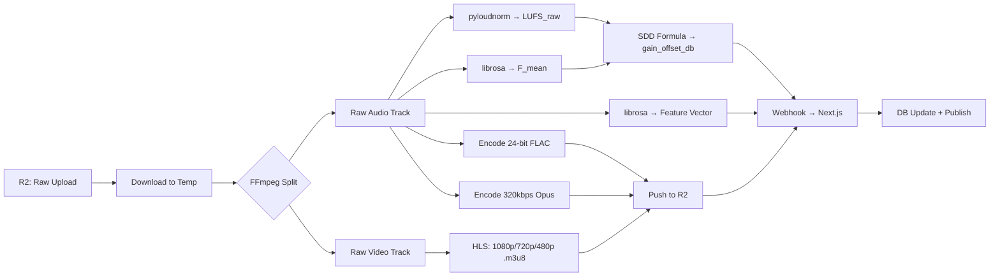

# ⚙️ Phase 4: Python DSP Worker & "Split Pipeline" Ingestion

> **Steps 31–45** · Estimated effort: 3–4 days
> Cross-reference: [main_idea.md](file:///Users/test2/Documents/dynamics-art/docs/main_idea.md) §2 (SDD Algorithm), §3 (Split Pipeline), §Interactive Canvas Addendum

---

## Objective

Build the complete Python DSP worker that receives upload jobs, splits audio from video, runs the Spectral Density Discount analysis, encodes tiered output formats (FLAC + Opus + HLS), extracts feature vectors, and pushes results back to R2 and the database.

---

## Pipeline Flow



---

## Steps

### Step 31 — Fetch Raw Uploads
- Use `boto3` with S3-compatible endpoint to download from R2
- Download to OS temp dir (`tempfile.mkdtemp()`)
- Validate downloaded file sizes match expected

### Step 32 — Split Pipeline (FFmpeg)
- Strip audio: `ffmpeg -i input.mp4 -vn -acodec pcm_s24le output.wav`
- Strip video: `ffmpeg -i input.mp4 -an -c:v copy output_video.mp4`
- If upload is audio-only (no video), skip video extraction

### Step 33 — Acoustic Engine: pyloudnorm
```python
import pyloudnorm as pyln
import soundfile as sf

data, rate = sf.read("output.wav")
meter = pyln.Meter(rate)
lufs_raw = meter.integrated_loudness(data)
```

### Step 34 — Acoustic Engine: librosa
```python
import librosa
import numpy as np

y, sr = librosa.load("output.wav", sr=None)
spectral_flat = librosa.feature.spectral_flatness(y=y)
f_mean = float(np.mean(spectral_flat))
```

### Step 35 — SDD Algorithm

$$LUFS_{adjusted} = LUFS_{raw} - (\alpha \times F_{mean})$$

- `α` (alpha) is a tunable constant — start with `α = 10.0` and calibrate
- Higher spectral flatness → larger discount → louder playback for complex music
- Store both `lufs_raw` and `gain_offset_db` for transparency

### Step 36 — Calculate Offset
```python
ALPHA = 10.0
TARGET_LUFS = -14.0  # industry standard target

lufs_adjusted = lufs_raw - (ALPHA * f_mean)
gain_offset_db = TARGET_LUFS - lufs_adjusted
```

### Step 37 — Premium Tier Encoding (FLAC)
```bash
ffmpeg -i output.wav -c:a flac -sample_fmt s32 -ar 96000 output.flac
```
- Preserve original sample rate if ≥ 44.1kHz
- 24-bit depth minimum

### Step 38 — Standard Tier Encoding (Opus)
```bash
ffmpeg -i output.wav -c:a libopus -b:a 320k output.opus
```

### Step 39 — Video Processing (HLS)
```bash
ffmpeg -i input_video.mp4 \
  -filter_complex "[0:v]split=3[v1][v2][v3]; \
    [v1]scale=1920:1080[v1out]; \
    [v2]scale=1280:720[v2out]; \
    [v3]scale=854:480[v3out]" \
  -map "[v1out]" -c:v:0 libx264 -b:v:0 5M \
  -map "[v2out]" -c:v:1 libx264 -b:v:1 3M \
  -map "[v3out]" -c:v:2 libx264 -b:v:2 1M \
  -f hls -hls_time 6 -hls_list_size 0 \
  -master_pl_name master.m3u8 \
  -var_stream_map "v:0 v:1 v:2" \
  output_%v/stream.m3u8
```

### Step 40 — Feature Extraction
```python
tempo, _ = librosa.beat.beat_track(y=y, sr=sr)
chroma = librosa.feature.chroma_stft(y=y, sr=sr)
mfcc = librosa.feature.mfcc(y=y, sr=sr, n_mfcc=13)
feature_vector = np.concatenate([
    [float(tempo)],
    np.mean(chroma, axis=1),
    np.mean(mfcc, axis=1)
])  # → 128-dim vector (pad/truncate as needed)
```

### Step 41 — Cloudflare Push
- Upload to R2 with organized key structure:
  ```
  media/{release_id}/audio/master.flac
  media/{release_id}/audio/stream.opus
  media/{release_id}/video/master.m3u8
  media/{release_id}/video/1080p/stream.m3u8
  media/{release_id}/video/720p/stream.m3u8
  media/{release_id}/video/480p/stream.m3u8
  media/{release_id}/video/*/segment_XXX.ts
  ```

### Step 42 — Callback Webhook
```python
import httpx

await httpx.post(
    f"{NEXTJS_URL}/api/webhooks/worker-callback",
    headers={"X-Webhook-Secret": WEBHOOK_SECRET},
    json={
        "release_id": release_id,
        "media_asset_id": media_asset_id,
        "status": "ready",
        "audio": { "flac_url": ..., "opus_url": ..., "lufs_raw": ..., "spectral_flatness": ..., "gain_offset_db": ... },
        "video": { "hls_manifest_url": ... },
        "feature_vector": feature_vector.tolist(),
        "duration_ms": int(librosa.get_duration(y=y, sr=sr) * 1000)
    }
)
```

### Step 43 — Database Update
- Next.js webhook handler receives callback
- Updates `media_assets.status` → `'ready'`
- Inserts `audio_tracks` row with all DSP values + URLs
- Inserts `video_tracks` row with HLS manifest URL

### Step 44 — Vector Storage
- Insert feature vector into `audio_features` table using pgvector

### Step 45 — Cleanup
- Python worker deletes all temp files after successful push
- `shutil.rmtree(temp_dir)`
- Next.js updates `releases.current_media_asset_id` → frontend shows "Published"

---

## Verification Checklist

- [ ] Upload a test WAV → worker calculates `lufs_raw`, `spectral_flatness`, `gain_offset_db`
- [ ] FLAC file plays correctly in a standalone player
- [ ] Opus file plays correctly
- [ ] HLS manifest loads in `hls.js` test page
- [ ] Feature vector inserts into pgvector column
- [ ] Webhook callback updates database correctly
- [ ] Temp files are cleaned up after processing

---

## Files Created / Modified

| Action | Path |
|---|---|
| NEW | `worker/services/r2.py` |
| NEW | `worker/services/ffmpeg_pipeline.py` |
| NEW | `worker/services/sdd_engine.py` |
| NEW | `worker/services/feature_extractor.py` |
| NEW | `worker/services/webhook.py` |
| MOD | `worker/routes/jobs.py` |
| MOD | `src/app/api/webhooks/worker-callback/route.ts` |
