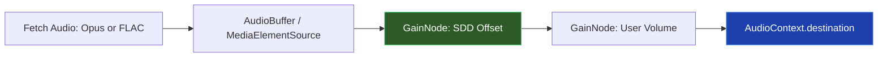

# 🎵 Phase 5: Global Player & Web Audio API (The Master Clock)

> **Steps 46–55** · Estimated effort: 2–3 days
> Cross-reference: [main_idea.md](file:///Users/test2/Documents/dynamics-art/docs/main_idea.md) §2 (SDD Playback), §4 (Unified Player), §Interactive Canvas Addendum (The Clock)

---

## Objective

Build the persistent audio player using the Web Audio API. The `AudioContext` is the Master Clock — all audio, video, and interactive canvas sync derives from it. Apply the SDD `gain_offset_db` non-destructively via a `GainNode`. **No limiters, no compressors — ever.**

---

## Audio Graph Architecture



> ⚠️ **CRITICAL:** No `DynamicsCompressorNode` or limiter may exist anywhere in this chain.

---

## Steps

### Step 46 — Zustand Player Store
- Expand `usePlayerStore` with full playback state:
  ```ts
  interface PlayerState {
    activeRelease: Release | null;
    isPlaying: boolean;
    currentTime: number;
    duration: number;
    volume: number; // 0–1
    canvasMode: 'video' | 'sheet' | 'midi' | 'lyrics';
    gainOffsetDb: number;
    queue: Release[];
    // Actions
    play: (release: Release) => void;
    pause: () => void;
    seek: (time: number) => void;
    setVolume: (vol: number) => void;
    setCanvasMode: (mode: CanvasMode) => void;
  }
  ```

### Step 47 — Persistent Shell (Mini-Player)
- Build `src/components/player/MiniPlayer.tsx`
- Mount in root `layout.tsx` **outside** the `{children}` slot so it persists across route changes
- Fixed bottom bar: album art, title, play/pause, scrub bar, volume
- Expandable to full-screen player view

### Step 48 — AudioContext Singleton
- Create `src/lib/audio/audioEngine.ts`
- Instantiate `AudioContext` as a lazy singleton (created on first user gesture):
  ```ts
  let ctx: AudioContext | null = null;
  export function getAudioContext(): AudioContext {
    if (!ctx) ctx = new AudioContext({ sampleRate: 48000 });
    return ctx;
  }
  ```

### Step 49 — The Master Clock
- `AudioContext.currentTime` is the single source of truth
- Create a `requestAnimationFrame` polling loop that reads `currentTime` and writes to Zustand store
- All other sync targets (HLS video, sheet music, MIDI, lyrics) read from this value

### Step 50 — Fetch SDD Offset
- On track load, fetch `gain_offset_db` from `audio_tracks` table via API route
- Store in Zustand: `gainOffsetDb`

### Step 51 — Non-Destructive Gain
- Create SDD `GainNode`:
  ```ts
  const sddGain = ctx.createGain();
  sddGain.gain.value = Math.pow(10, gainOffsetDb / 20); // dB → linear
  ```
- Chain: `source → sddGain → volumeGain → destination`

### Step 52 — Tiered Audio Routing
- Free tier: fetch Opus URL directly from R2
- Premium tier: request Signed FLAC URL from server action (Step 28)
- Use `fetch()` → `decodeAudioData()` for full buffer, or `MediaElementSource` for streaming

### Step 53 — Audio Graph Connection
```ts
const source = ctx.createBufferSource();
source.buffer = decodedBuffer;
source.connect(sddGainNode);
sddGainNode.connect(volumeGainNode);
volumeGainNode.connect(ctx.destination);
source.start(0, offset);
```

### Step 54 — Audiophile Transport Controls
- Custom play/pause button (no native `<audio>` controls)
- High-precision seek bar with `currentTime` / `duration` display (mm:ss.ms)
- Smooth volume slider writing to `volumeGainNode.gain.value`
- Keyboard shortcuts: Space (play/pause), ← → (seek ±5s)

### Step 55 — Acoustic Verification Audit
- Add dev-only logging that traverses the full audio graph on each play:
  ```ts
  function auditAudioGraph(node: AudioNode) {
    if (node instanceof DynamicsCompressorNode) {
      console.error('🚨 LIMITER DETECTED — VIOLATION OF SDD PRINCIPLES');
    }
    // recursively check connected nodes
  }
  ```
- This must run in development and fail loudly

---

## Verification Checklist

- [ ] Mini-player persists across all route navigations
- [ ] Audio plays without interruption when navigating pages
- [ ] `gain_offset_db` is applied — verify with test tracks of known LUFS
- [ ] Free users receive Opus, Premium users receive FLAC
- [ ] No `DynamicsCompressorNode` in the audio graph (audit log clean)
- [ ] Transport controls (play, pause, seek, volume) all work
- [ ] `currentTime` updates smoothly at ~60fps via rAF

---

## Files Created / Modified

| Action | Path |
|---|---|
| NEW | `src/lib/audio/audioEngine.ts` |
| NEW | `src/lib/audio/masterClock.ts` |
| NEW | `src/components/player/MiniPlayer.tsx` |
| NEW | `src/components/player/TransportControls.tsx` |
| NEW | `src/components/player/SeekBar.tsx` |
| NEW | `src/components/player/VolumeSlider.tsx` |
| MOD | `src/stores/usePlayerStore.ts` |
| MOD | `src/app/layout.tsx` |
