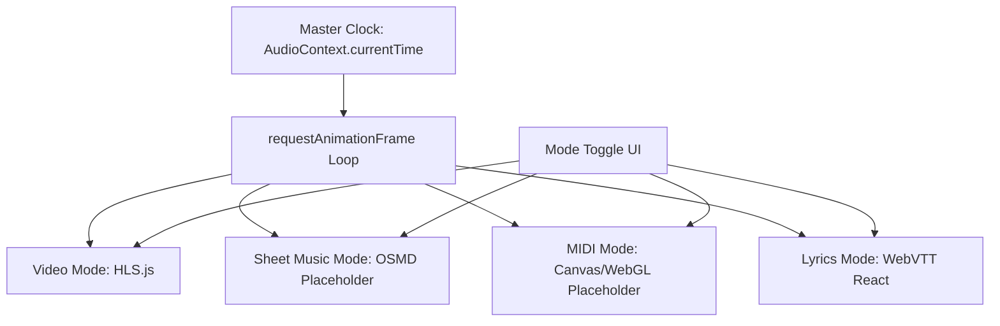

# 🎨 Phase 6: Video HLS & The Interactive Canvas

> **Steps 56–68** · Estimated effort: 4–5 days
> Cross-reference: [main_idea.md](file:///Users/test2/Documents/dynamics-art/docs/main_idea.md) §Interactive Canvas Addendum (all subsections)

---

## Objective

Build the multi-modal Release page canvas with 4 switchable views — Video (HLS), Sheet Music, MIDI Visualizer, and Opera/Lyrics — all synced to the `AudioContext` Master Clock via `requestAnimationFrame`.

---

## Canvas Mode Architecture



---

## Steps

### Step 56 — Multi-Modal UI
- Build `src/app/release/[id]/page.tsx` — the Release page
- Create `src/components/canvas/CanvasContainer.tsx` with 4 toggle tabs:
  - 🎬 Video · 🎼 Sheet Music · 🎹 MIDI · 📜 Lyrics
- Only render the active mode's component (lazy mount/unmount)

### Step 57 — HLS Integration
- `pnpm add hls.js`
- Create `src/components/canvas/VideoCanvas.tsx`
- Mount a **strictly muted** `<video>` element (audio comes from Web Audio API, not the video tag)
- Point HLS source at R2 `.m3u8` manifest URL

### Step 58 — Master Clock Syncing (Video)
- On each rAF tick, compare `video.currentTime` with `AudioContext.currentTime`
- If drift > 50ms, force `video.currentTime = audioTime`
- Smoothly handle play/pause/seek propagation from Master Clock to `<video>`

### Step 59 — Background Optimization
- When `canvasMode` !== `'video'` or app is backgrounded:
  - Pause HLS download (`hls.stopLoad()`)
  - FLAC/Opus audio continues uninterrupted
- On return to video mode: `hls.startLoad()` + re-sync

### Step 60 — rAF Loop (The Sync Engine)
- Create `src/lib/audio/syncLoop.ts`
- Single rAF loop that broadcasts `currentTime` to all active canvas subscribers:
  ```ts
  const subscribers = new Set<(time: number) => void>();
  function tick() {
    const time = getAudioContext().currentTime;
    subscribers.forEach(fn => fn(time));
    requestAnimationFrame(tick);
  }
  ```

### Step 61 — Sheet Music Mode (Placeholder)
- Create `src/components/canvas/SheetMusicCanvas.tsx`
- Mount placeholder wrapper for OpenSheetMusicDisplay (OSMD) or VexFlow
- Display message: "Sheet music rendering — connected to existing code"
- *(Per user note: existing code handles this, just wire the placeholder)*

### Step 62 — Sheet Music Sync
- Subscribe to rAF sync loop
- When integrated with OSMD, map `currentTime` → measure/beat position
- Auto-scroll / page-turn based on clock

### Step 63 — MIDI Visualizer (Placeholder)
- Create `src/components/canvas/MidiCanvas.tsx`
- Mount HTML5 `<canvas>` element placeholder for falling notes visualization
- Display message: "MIDI visualizer — connected to existing code"
- *(Per user note: existing code handles this, just wire the placeholder)*

### Step 64 — MIDI Sync
- Subscribe to rAF sync loop
- When integrated, parse `.mid` file for note-on/note-off events
- Render falling notes mapped to `currentTime`

### Step 65 — Opera/Lyrics Mode
- Create `src/components/canvas/LyricsCanvas.tsx`
- Sleek typography-focused UI with serif font and graceful line transitions
- Active line highlighted, surrounding lines dimmed

### Step 66 — WebVTT Parsing
- Create `src/lib/parsers/webvtt.ts`
- Parse `.vtt` files into:
  ```ts
  interface VttCue {
    startMs: number;
    endMs: number;
    text: string;
    language?: string;
  }
  ```

### Step 67 — Libretto Sync
- Subscribe to rAF sync loop
- Binary search current cue based on `currentTime`
- Update active cue via direct DOM manipulation (not React state) to avoid re-render lag

### Step 68 — Multi-Language Toggle
- UI toggle in Lyrics mode to show:
  - Source text only (e.g., Italian)
  - Translation only (e.g., English)
  - Side-by-side (both)
- Reads `language_code` from `aux_files` table

---

## Verification Checklist

- [ ] Canvas mode toggles render correct component
- [ ] HLS video plays muted, audio comes from Web Audio API
- [ ] Video stays synced to Master Clock over 5+ minutes of playback
- [ ] Background optimization: HLS stops downloading when not in video mode
- [ ] Sheet Music and MIDI placeholders mount without errors
- [ ] Lyrics mode correctly parses and displays WebVTT cues in sync
- [ ] Multi-language toggle switches between source/translation/both

---

## Files Created / Modified

| Action | Path |
|---|---|
| NEW | `src/app/release/[id]/page.tsx` |
| NEW | `src/components/canvas/CanvasContainer.tsx` |
| NEW | `src/components/canvas/VideoCanvas.tsx` |
| NEW | `src/components/canvas/SheetMusicCanvas.tsx` |
| NEW | `src/components/canvas/MidiCanvas.tsx` |
| NEW | `src/components/canvas/LyricsCanvas.tsx` |
| NEW | `src/lib/audio/syncLoop.ts` |
| NEW | `src/lib/parsers/webvtt.ts` |
