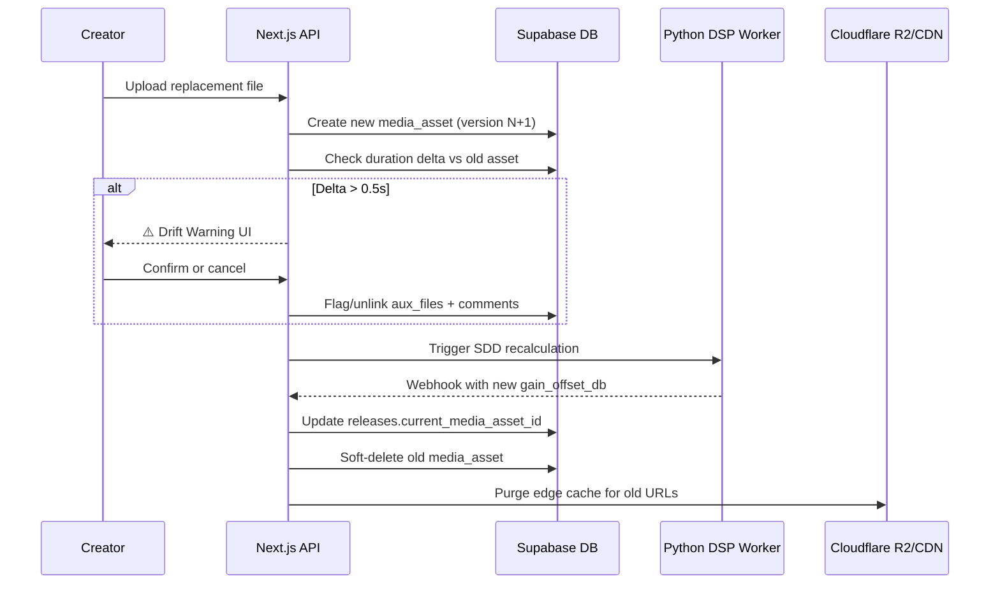

# ♻️ Phase 8: Versioning & Non-Destructive Media Replacement

> **Steps 79–88** · Estimated effort: 2–3 days
> Cross-reference: [main_idea.md](file:///Users/test2/Documents/dynamics-art/docs/main_idea.md) §Versioning Addendum (Non-Destructive Media Replacement)

---

## Objective

Allow creators to replace audio masters, video tracks, or auxiliary files post-publication without breaking permanent URLs, play counts, community comments, or recommendation vectors. Implement duration drift detection and cache invalidation.

---

## Replacement Flow



---

## Steps

### Step 79 — Replacement UI
- Add "Replace Media" section to creator dashboard
- Separate buttons: "Replace Audio Master", "Replace Video Track", "Replace Auxiliary Files"
- Each opens a file picker scoped to the correct file types
- Show current version number and upload history

### Step 80 — Database Pointer Shift
- On replacement upload:
  1. Create new `media_assets` row with `version = old.version + 1`
  2. Process file through upload pipeline (same as Phase 3/4)
  3. On completion, update `releases.current_media_asset_id` → new asset
- Old asset row preserved (soft-deleted) — permanent UUID, play count, and URL unchanged on the `releases` row

### Step 81 — Trigger SDD Recalculation
- If the replacement is an **audio master**, automatically re-trigger the Python DSP worker
- Worker recalculates: `lufs_raw`, `spectral_flatness`, `gain_offset_db`
- New `audio_tracks` row created linked to the new `media_assets` row
- New feature vector inserted into `audio_features`

### Step 82 — Duration Validation
- Pre-flight check before finalizing replacement:
  ```ts
  const oldDuration = oldMediaAsset.duration_ms;
  const newDuration = newMediaAsset.duration_ms;
  const deltaMs = Math.abs(newDuration - oldDuration);
  const isDrift = deltaMs > 500; // 0.5s threshold
  ```

### Step 83 — Drift Warning UI
- If `isDrift === true`, show a modal warning:
  > ⚠️ **Duration Drift Detected**
  > The new file is X.Xs longer/shorter than the original.
  > Synced interactive data (MIDI, sheet music, lyrics) and timestamped comments may become out-of-sync.
  > **[Proceed Anyway]** · **[Cancel]**

### Step 84 — Data Unlinking
- If creator proceeds past drift warning:
  - Flag all `aux_files` linked to the old `media_asset` as `sync_status: 'drifted'`
  - Creator can re-upload corrected aux files for the new duration

### Step 85 — Comment Fallback
- If severe drift: update all `comments` with `timestamp_ms` to set a flag `is_synced: false`
- UI shows these comments without clickable timecodes
- Alternative: recalculate approximate timecodes using ratio mapping

### Step 86 — Cache Invalidation
- Create `src/lib/cloudflare/purgeCache.ts`
- On replacement completion, call Cloudflare API to purge edge cache:
  ```ts
  await fetch(`https://api.cloudflare.com/client/v4/zones/${zoneId}/purge_cache`, {
    method: 'POST',
    headers: { Authorization: `Bearer ${CF_API_TOKEN}` },
    body: JSON.stringify({ files: [oldFlacUrl, oldOpusUrl, oldHlsUrl] })
  });
  ```
- Add `CF_ZONE_ID` and `CF_API_TOKEN` to `.env.local`

### Step 87 — Persistence Testing
- End-to-end test: upload → publish → accumulate play count → replace audio → verify:
  - [ ] Play count preserved
  - [ ] Permanent URL unchanged
  - [ ] Old pgvector recommendations still work
  - [ ] New SDD offset applied on next play

### Step 88 — Storage Optimization
- Implement soft-delete: set `media_assets.status = 'replaced'`
- Background cleanup job (or manual) to purge R2 objects for replaced assets after a retention period (e.g., 30 days)
- Track storage usage per creator

---

## Verification Checklist

- [ ] Replacing audio master triggers full DSP recalculation
- [ ] Replacing video track re-generates HLS without affecting audio
- [ ] Duration drift > 0.5s triggers warning modal
- [ ] Aux files are flagged/unlinked when drift is accepted
- [ ] Timestamped comments degrade gracefully on drift
- [ ] Cloudflare cache purges for replaced asset URLs
- [ ] Play count and permanent URL survive replacement
- [ ] Old media assets are soft-deleted, not hard-deleted

---

## Files Created / Modified

| Action | Path |
|---|---|
| NEW | `src/app/dashboard/release/[id]/replace/page.tsx` |
| NEW | `src/lib/cloudflare/purgeCache.ts` |
| NEW | `src/app/api/releases/[id]/replace/route.ts` |
| MOD | `src/app/api/webhooks/worker-callback/route.ts` |
| MOD | `src/db/schema/media-assets.ts` |
| MOD | `src/db/schema/comments.ts` |
